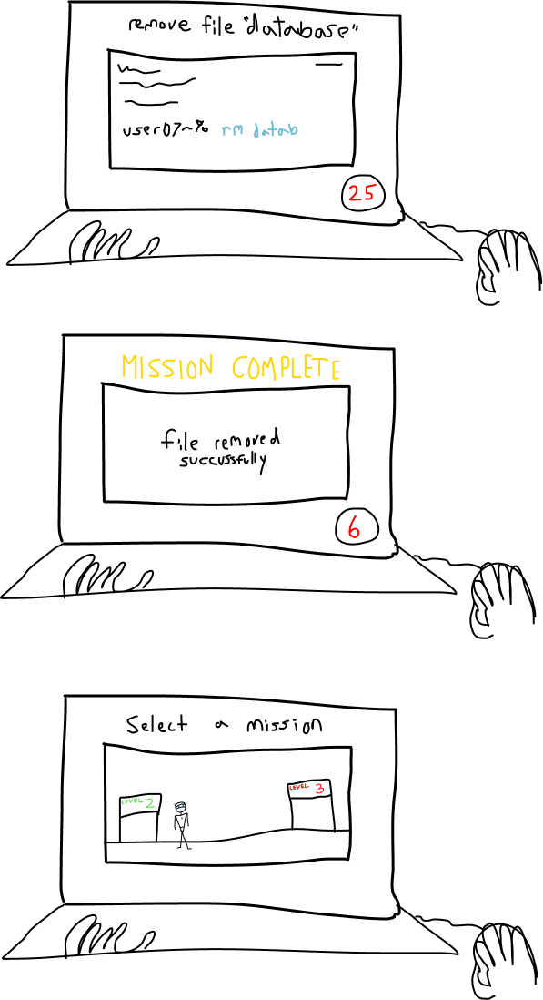

# Cyber Spy

## Elevator Pitch

Cyber Spy is an educational puzzle game with a dramatic storyline attached. Cyber Spy will introduce players to basic bash commands through a time based environment. The story follows a hacker, and his companion Alfred, through several missions to dethrone a corrupt organization. Players should be able to traverse through the terminal efficiently with the knowledge gained after completing this game.

## Influences (Brief)

- Super Mario World:
  - Medium: Game
  - Explanation: *We plan to mimic the style of super mario world and the pixel art. The movement in between levels will resemble the movement of a platformer like mario*
- Hacknet (https://en.wikipedia.org/wiki/Hacknet):
  - Medium: Game
  - Explanation: Much like our planned game, Hacknet is a hacking-based puzzle game in which the majority of gameplay comes in the form of typing commands in a Unix-like terminal. The main goal in Hacknet is to ‘hack’ into other computer systems, steal imaginary files, and acquire superuser privileges. It incorporates gameplay aspects like memory management (you can only run a certain amount of programs before you run out of memory) and a timer later on in the game to make doing so more difficult. We plan on taking inspiration from the terminal design, as well as aspects like the timer.
- Mission Impossible
  - Medium: Movie
  - Explanation: We plan on creating a mission based game where the user must break into a facility (directory) using terminal commands. There will also be a time constraint. There will also be a butler/narrator character, much like the tech team in Mission impossible, that will guide you through your mission, providing hints and instructions as needed.

## Core Gameplay Mechanics (Brief)

- Typing commands into terminal to perform actions
- 2D Navigation Throughout the facility
- Item Collection within your inventory
- Display success screen after completing a mission
- Display defeat screen after failing a mission

# Learning Aspects

## Learning Domains

Introduction Systems Programming
Machine Organization and Assembly Language
Introduction to Software Engineering

## Target Audiences

Incoming freshmen in college pursuing a computer science degree. Specifically students learning how to use bash commands.

## Target Contexts

This could be used as an introductory assignment for CISC210. Students looking to practice their skills in the terminal can also play this game in their free time.

## Learning Objectives

After playing Cyber Spy, students should be able to traverse the terminal using the command line efficiently.

- By the end of the game, students should be able to access files using terminal commands
- By the end of the game, students should be able to modify the contents a file using basic nano commands
- By the end of the game, students should be able to navigate through different directories
- By the end of the game, students should be able to move/remove files across different directories using terminal commands.
- By the end of the game, students should be able to create and write to new directories and files.

## Prerequisite Knowledge

- Players should know how to type a minimum of 30 wpm
- Players should know that commands can cause their computer to perform actions

## Assessment Measures

*Describe how the learning will be assessed, e.g., pre/post multiple-choice test, or SAT, or some other instrument.*

A short pre-test, and matching post-test.

*If proposing a new instrument, briefly and concisely list some example assessment questions.*

Given a directory name, utilize bash commands to access it.
Given a file name, utilize bash commands to delete it.
Given a file and directory name, utilize bash commands to move it to another given directory.

# What sets this project apart?

- Most coding assessments that introduce students to the terminal don't intend to be entertaining, but our game will have fun graphics, an engaging story, and thrilling gameplay.
- The game will be educational yet still have aspects of a fun video game integrated seamlessly into it.

# Player Interaction Patterns and Modes

## Player Interaction Pattern

*Describe how people play your game, how many players are involved at once, how they interact with the system works, etc.*

This is a single player game. The player will interact with the via typing keyboard inputs, moving with arrows, and clicking on menu buttons when needed.

## Player Modes

*Your game has one or more player modes. Describe each discrete mode, considering things like menus too. Generally describe the transitions between modes too.*

- Single-player: You repeatedly complete missions to advance through the story.

# Gameplay Objectives

- Reach the end of the mission:
    - Description: Do what the prompt at the top of the screen requests
    - Alignment: This aligns with our learning objective because it forces players to hone the skills they've learned and will help them memorize commands after repeated use.
- Complete all missions to finish the game:
    - Description: Traverse through each mission by accomplishing their respective goals
    - Alignment: Each mission will establish a new topic for the player to learn. Each topic will build upon each other, and by the end players will know what each command does and when to use them.

# Procedures/Actions

*Describe the control scheme and what actions a user can take in the game.*

You can type when a command line is shown, and enter these commands. In between missions you can move around using arrow keys, and press a button to start mission.

# Rules

*What resources are available to the player that they make use of?  How does this affect gameplay? How are these resources finite?*

- If the player enters an invalid command, they will get an error and hint
- If the player enters a valid command, it will work and they will advance through the current mission
- They will have a toolset of commands available to them to reference and utilize
- The list of commands that they will learn through the missions are as follows:
ls
cd
rm
touch
cat
mv
cp

# Objects/Entities

*What other things are in the world that you need to design? These may or may not directly translate to actual objects and classes.*

- There is a text input for users to type into
- There is a command line that user input is displayed when entered
- There is a prompt
- There is a main character to control in between missions
- There is a companion character that will speak to you during missions
- There is a timer during missions

## Core Gameplay Mechanics (Detailed)

- Typing commands into your “terminal”*: *The majority of game interaction will take place by the player typing commands into their terminal. Assuming the user types the correct command sequence, they will be moved to their next task. The player will initially start with a limited number of basic commands such as ‘ls’, then as they progress further, unlock new commands through their companion. E.g., “use ‘cd’ to access a new directory, or in this case your backpack, with ‘cd backpack’”.
- Picking up tools*: *A large part of the education in Cyber Spy will take place because of an increase in difficulty as a player progresses through levels. This increase will be due to the player picking up tools along the way in the form of new commands. Some of these commands will be highlighted/vibrating in levels for the player to collect, while others will be transferred directly to the players backpack via their companion. It is then up to the player to decide when the right time to use a given tool is.
- Navigation through 2D levels*: *The high-level goal of this game is to navigate your player sprite through several rooms of an advanced technology facility and destroy the internal corruption taking place there. You will navigate your player using terminal commands, and with the help of your companion to explain what new tools do as you collect them.

    
## Feedback

*Explicitly describe what visual/audio/animation indicators there are that give players feedback on their progress towards their gameplay objectives (and ideally the learning objectives).*

*Describe what longer-term feedback you detect and give that guides the player in their learning and lets them know how they are doing in regards to the learning objectives.*

If a command is wrong, your companion will tell you it is wrong and give you a hint in the right direction. Text on the screen shows if a command worked or did not work. 

# Story and Gameplay

## Presentation of Rules

Players have a virtual assistant like Alfred is to Batman. Alfred will introduce your mission, tasks, and give you your tools (ls, cd, touch, etc.) as they become needed.

## Presentation of Content

Players will slowly be given tools as mentioned before, and expected to use them at least one time before being given a different tool by alfred, e.g. Alfred: “You’re gonna need a wrench to break that glass. Use 'ls' to view your backpack items, including the wrench I just gave you.”

## Story (Brief)

Our story will follow a hacker and his trusty companion through a series of missions to dethrone a corrupt organization. They will do this using a variety of commands to access the opposition's files, and take down their servers. All while attempting to be stealthy and quick enough to finish these missions before the time runs out. Will your coding abilities be able to save the world? Or will you fold under pressure? Who can be trusted? Cyber Spy will answer all of your questions.

## Storyboarding

# Assets Needed

## Aethestics

This game should feel high pressure, but rewarding. It should encourage players to code fast and also avoid mistakes. The aesthetics of the game will be dark, dramatic, and retro.

## Graphical

- Characters List
  - Agent User
  - Companion (Woz/Alfred)
- Textures:
  - Level entrances
- Environment Art/Textures:
  - Coding background
  - Level select background
  - Unique backgrounds for special directories

## Audio

*Game region/phase/time are ways of designating a particularly important place in the game.*

- Music List (Ambient sound)
  - General gameplay: 8 bit, eerie stealth music like the music from Batman Begins GBA: https://www.youtube.com/watch?v=MIppc7zfqis&list=PLO4jlmGoc6uAy9S9J3SPXv-UrHBm9Bgz9&index=2
  - General gameplay: 8 bit, action music like the music from Batman Begins GBA:
https://www.youtube.com/watch?v=Px-bsXoXdhc&list=PLO4jlmGoc6uAy9S9J3SPXv-UrHBm9Bgz9&index=1
  
*Game Interactions are things that trigger SFX, like character movement, hitting a spiky enemy, collecting a coin.*

- Sound List (SFX)
  - Entering a line of code: pleasant ping noise found online
  - Typing sounds: recorded by us or found on YouTube
  - Error: Buzz/dud sound
  - Dialogue: digital noises made to queue while speaking occurs, but all dialogue will be text written on the screen

# Metadata

* Template created by Austin Cory Bart <acbart@udel.edu>, Mark Sheriff, Alec Markarian, and Benjamin Stanley.
* Version 0.0.3

